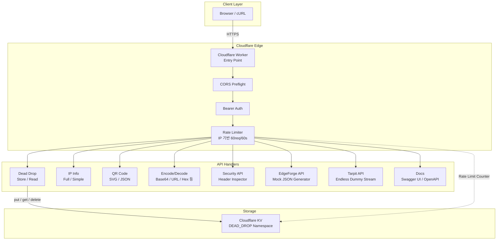
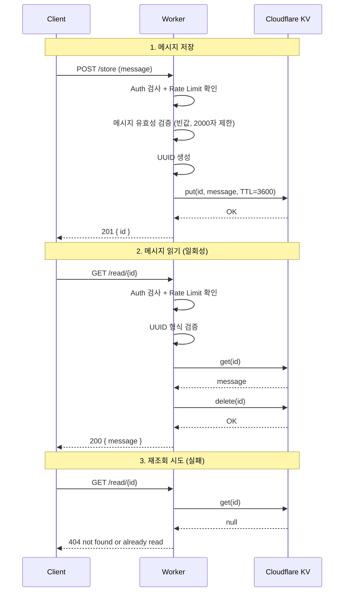

# Kalpha's API

실용적인 공개 API 모음 — Cloudflare Workers 기반으로 빠르고 안정적입니다.

📄 **API 문서**: [https://api.kalpha.kr/docs](https://api.kalpha.kr/docs)

---

## 아키텍처



### 요청 처리 흐름

```plaintext
1. 클라이언트 → HTTPS 요청 → Cloudflare Worker (Entry Point)
2. CORS Preflight 처리 (OPTIONS → 204 응답)
3. Bearer 토큰 인증 검사 (/store, /read/{id} 대상, API_KEY 설정 시)
4. IP 기반 Rate Limiting (KV 카운터, 60초 윈도우, 60회 제한)
5. 라우팅 → 해당 핸들러로 요청 전달
   ├── POST /store       → 메시지 저장 (KV, TTL 1시간)
   ├── GET  /read/{id}   → 메시지 읽기 & 즉시 삭제
   ├── GET  /ip          → CF 엣지 데이터 기반 IP 정보
   ├── GET  /ip/simple   → IP 주소만 반환
   ├── GET  /qr          → QR 코드 생성 (SVG/JSON)
   ├── GET  /encode      → 텍스트 인코딩 (Base64, URL, Hex 등)
   ├── GET  /decode      → 데이터 디코딩
   ├── GET  /edgeforge   → 가짜(Mock) JSON 응답 생성
   ├── GET  /.env 등     → Tarpit (악성 봇 대기용 무한 스트림 반환)
   ├── GET  /openapi.json → OpenAPI 3.0 스펙
   └── GET  / 또는 /docs  → Swagger UI
```

### Dead Drop 보안 흐름



---

## 제공 API

| API | 설명 |
|-----|------|
| **Dead Drop** | 한 번만 읽을 수 있는 임시 비밀 메시지 저장소 |
| **IP Info** | 요청자의 IP 주소 및 지리/네트워크 정보 조회 |
| **QR Code** | QR 코드 생성 (SVG/JSON, WiFi·vCard·이메일 등 지원) |
| **Encode/Decode** | 다양한 형식의 인코딩/디코딩 (Base64, URL, HTML, Hex 등) |
| **Security API** | HTTP 보안 헤더 분석 및 등급 산출 |
| **EdgeForge API (Beta)** | 테스트를 위한 가짜(Mock) JSON 응답 생성기 |
| **Tarpit API** | 악성 봇 지연용 허니팟 API (`/.env` 등) |

---

## Dead Drop API

한 번 읽으면 즉시 삭제되는 일회용 비밀 메시지를 저장하고 공유합니다.

### 메시지 저장

```bash
# JSON 바디로 저장
curl -X POST https://api.kalpha.kr/store \
  -H "Content-Type: application/json" \
  -d '{"message":"비밀 메시지입니다"}'

# 또는 텍스트 바디로 저장
echo "secret" | curl -X POST https://api.kalpha.kr/store \
  -H "Content-Type: text/plain" --data-binary @-
```

**응답:**
```json
{ "id": "550e8400-e29b-41d4-a716-446655440000" }
```

### 메시지 읽기

```bash
curl https://api.kalpha.kr/read/<id>
```

**응답:**
```json
{ "message": "비밀 메시지입니다" }
```

> ⚠️ 메시지는 **한 번 읽으면 즉시 삭제**됩니다. 저장 후 1시간이 지나면 자동 만료됩니다.

### 엔드포인트 요약

| 메서드 | 경로 | 설명 |
|--------|------|------|
| `POST` | `/store` | 메시지 저장 (JSON 또는 plain text) |
| `GET` | `/read/{id}` | 메시지 읽기 및 즉시 삭제 |

---

## IP Info API

요청자의 IP 주소와 함께 국가, 도시, ISP, 위경도, 타임존 등의 정보를 반환합니다. Cloudflare 엣지 네트워크가 제공하는 데이터를 사용하므로 외부 API 호출이 없고 매우 빠릅니다.

### 전체 IP 정보 조회

```bash
curl https://api.kalpha.kr/ip
```

**응답:**
```json
{
  "ip": "203.0.113.1",
  "country": "KR",
  "city": "Seoul",
  "region": "Seoul",
  "regionCode": "11",
  "latitude": 37.566,
  "longitude": 126.978,
  "timezone": "Asia/Seoul",
  "postalCode": "04524",
  "asn": 4766,
  "isp": "Korea Telecom",
  "continent": "AS",
  "httpProtocol": "HTTP/2",
  "tls": "TLSv1.3",
  "userAgent": "curl/8.0.0"
}
```

### IP 주소만 조회

터미널이나 스크립트에서 간편하게 사용:

```bash
curl https://api.kalpha.kr/ip/simple
# 출력: 203.0.113.1
```

### 엔드포인트 요약

| 메서드 | 경로 | 설명 |
|--------|------|------|
| `GET` | `/ip` | 전체 IP 정보 (JSON) |
| `GET` | `/ip/simple` | IP 주소만 (텍스트) |

---

## QR Code API

텍스트, URL, WiFi, 연락처 등 다양한 데이터를 QR 코드로 변환합니다. SVG 이미지 또는 JSON 매트릭스로 출력합니다.

### 기본 사용

```bash
# 텍스트/URL → QR 코드 (SVG 이미지)
curl "https://api.kalpha.kr/qr?data=https://kalpha.kr" -o qr.svg

# 색상/크기 커스터마이즈
curl "https://api.kalpha.kr/qr?data=hello&color=%231e40af&bg=%23f0f9ff&size=500" -o qr.svg

# JSON 매트릭스 출력
curl "https://api.kalpha.kr/qr?data=hello&format=json"
```

### 구조화된 데이터 타입

```bash
# WiFi QR 코드 (스마트폰으로 스캔하면 자동 연결)
curl "https://api.kalpha.kr/qr?type=wifi&ssid=MyWiFi&password=1234&encryption=WPA" -o wifi.svg

# 연락처 (vCard)
curl "https://api.kalpha.kr/qr?type=vcard&name=Hong Gildong&phone=010-1234-5678&email=hong@example.com" -o contact.svg

# 이메일
curl "https://api.kalpha.kr/qr?type=email&to=dev@kalpha.kr&subject=Hello" -o email.svg

# 전화
curl "https://api.kalpha.kr/qr?type=phone&number=010-1234-5678" -o phone.svg

# SMS
curl "https://api.kalpha.kr/qr?type=sms&number=010-1234-5678&message=안녕하세요" -o sms.svg

# 위치 (위도/경도)
curl "https://api.kalpha.kr/qr?type=geo&lat=37.5660&lng=126.9784" -o location.svg
```

### 옵션

| 파라미터 | 기본값 | 설명 |
|-----------|--------|------|
| `data` | - | 인코딩할 텍스트 또는 URL |
| `type` | `text` | 데이터 타입 (text, wifi, email, phone, sms, geo, vcard) |
| `format` | `svg` | 출력 형식 (svg, json) |
| `size` | `300` | 이미지 크기 (50-1000px) |
| `color` | `#000000` | QR 코드 색상 |
| `bg` | `#ffffff` | 배경 색상 |
| `ecl` | `M` | 오류 정정 레벨 (L, M, Q, H) |
| `margin` | `2` | 여백 (0-10) |

### 엔드포인트 요약

| 메서드 | 경로 | 설명 |
|--------|------|------|
| `GET` | `/qr` | QR 코드 생성 (SVG 또는 JSON) |

---

## Encode/Decode API

텍스트를 다양한 형식으로 인코딩하거나, 인코딩된 데이터를 디코딩합니다. 외부 API 호출 없이 즉시 처리됩니다.

### 지원 형식

| 형식 | 설명 |
|------|------|
| `base64` | 표준 Base64 인코딩 |
| `base64url` | URL-safe Base64 (`+/` → `-_`, 패딩 제거) |
| `url` | URL 인코딩 (`encodeURIComponent`) |
| `html` | HTML 엔티티 (`<` → `&lt;` 등) |
| `hex` | 16진수 문자열 (`hello` → `68656c6c6f`) |
| `unicode` | 유니코드 이스케이프 (`\uXXXX`) |
| `rot13` | ROT13 알파벳 치환 (인코딩 = 디코딩) |

### 인코딩

```bash
# Base64 인코딩
curl "https://api.kalpha.kr/encode?text=hello&format=base64"
```

**응답:**
```json
{
  "input": "hello",
  "format": "base64",
  "result": "aGVsbG8="
}
```

### 디코딩

```bash
# Base64 디코딩
curl "https://api.kalpha.kr/decode?data=aGVsbG8=&format=base64"
```

**응답:**
```json
{
  "input": "aGVsbG8=",
  "format": "base64",
  "result": "hello"
}
```

### 엔드포인트 요약

| 메서드 | 경로 | 설명 |
|--------|------|------|
| `GET` | `/encode?text={text}&format={format}` | 텍스트 인코딩 |
| `GET` | `/decode?data={data}&format={format}` | 데이터 디코딩 |

---

## Security API

특정 웹사이트의 보안 헤더를 분석하여 점수(A~F)와 등급(0~100)을 산출합니다.

### 헤더 분석

```bash
curl "https://api.kalpha.kr/security/headers?url=https://kalpha.kr"
```

**응답:**
```json
{
  "url": "https://kalpha.kr",
  "pageType": "normal",
  "statusCode": 200,
  "score": "A",
  "grade": 85,
  "headers": {
    "X-Content-Type-Options": "nosniff"
  },
  "analysis": [
    {
      "header": "X-Content-Type-Options",
      "status": "excellent",
      "message": "nosniff is set properly"
    }
  ]
}
```

### 엔드포인트 요약

| 메서드 | 경로 | 설명 |
|--------|------|------|
| `GET` | `/security/headers?url={url}` | 웹사이트 보안 헤더 분석 |

---

## EdgeForge API (Beta)

프론트엔드 개발이나 예외 처리를 테스트할 때 사용할 수 있는 **가짜(Mock) JSON 응답 생성기**입니다.

### 커스텀 JSON 응답 생성

HTTP 상태 코드와 지연 시간(Delay), 그리고 반환받고 싶은 JSON 바디를 쿼리 파라미터로 넘깁니다.

```bash
# 403 에러를 발생시키며, 2초(2000ms) 지연 후 응답
curl "https://api.kalpha.kr/edgeforge?status=403&delay=2000&body={\"error\":\"Not%20Authorized\"}"
```

**응답 (HTTP 403 상태 & 2초 딜레이):**
```json
{
  "error": "Not Authorized"
}

```

### 엔드포인트 요약

| 메서드 | 경로 | 설명 |
|--------|------|------|
| `GET / POST` | `/edgeforge` | 상태 코드(status), 지연(delay), 바디(body)를 받아 그대로 반환 |

---

## Tarpit API (Honeypot)

악성 봇과 취약점 스캐너의 리소스(스레드)를 고갈시켜 방어하기 위한 재미있고 실용적인 API 타르핏입니다. 시스템 파일이나 크리덴셜, 취약 경로를 찌르는 요청을 가로채어 30초 동안 1초 간격으로 의미 없는 스트림 데이터를 끊어서 내려보냅니다.

### 동작 방식

스캐너가 봇넷으로 찔러볼 법한 약 60여 개의 주요 취약점 경로(`/wp-admin`, `/.env`, `/.git/config`, `/.ssh/id_rsa`, `/actuator` 등)에 접근할 때 자동으로 트리거됩니다. (HTTP 상태 코드 200 응답 후 진행 됨)

```bash
# 해커의 스크립트가 취약점을 찌르는 상황 가정:
curl -N https://api.kalpha.kr/.env
```

**응답 (30초간 1초마다 1줄씩 지연 스트리밍 출력됨):**
```json
{
  "status": "loading",
  "data": [
    {"id": 0, "hash": "uuid-1...", "status": "pending_validation"},
    {"id": 1, "hash": "uuid-2...", "status": "pending_validation"},
    ... (30초 동안 계속됨) ...
    {"end": true}
  ]
}
```

> **왜 유용한가요?:** Cloudflare Workers에서는 I/O (네트워크 대기) 타이머가 과금되는 CPU 자원 소모 시간에 들어가지 않아 방어자쪽에는 페널티가 없습니다. 반면 스레드 풀을 무작정 늘릴 수 없는 공격자 측의 소켓 리소스를 최대치로 잡아먹을 수 있습니다.

### 엔드포인트 요약

| 메서드 | 경로 | 설명 |
|--------|------|------|
| `GET` | `/.env` 외 60여개 | 악성 봇 가두기 용도의 30초 무한 데이터 스트림 |

---

## 로컬 개발 및 배포

# URL 인코딩
curl "https://api.kalpha.kr/encode?text=hello world&format=url"

# HTML 엔티티
curl "https://api.kalpha.kr/encode?text=<script>alert(1)</script>&format=html"

# Hex 인코딩
curl "https://api.kalpha.kr/encode?text=hello&format=hex"
```

**응답:**
```json
{ "input": "hello", "format": "base64", "result": "aGVsbG8=" }
```

### 디코딩

```bash
# Base64 디코딩
curl "https://api.kalpha.kr/decode?data=aGVsbG8=&format=base64"

# Hex 디코딩
curl "https://api.kalpha.kr/decode?data=68656c6c6f&format=hex"

# URL 디코딩
curl "https://api.kalpha.kr/decode?data=hello%20world&format=url"
```

**응답:**
```json
{ "input": "aGVsbG8=", "format": "base64", "result": "hello" }
```

### 엔드포인트 요약

| 메서드 | 경로 | 설명 |
|--------|------|------|
| `GET` | `/encode` | 텍스트 인코딩 (text, format 파라미터 필수) |
| `GET` | `/decode` | 데이터 디코딩 (data, format 파라미터 필수) |
| `GET` | `/security/headers` | 보안 헤더 분석 (url 파라미터 필수) |

---

## Security API

대상 URL의 HTTP 보안 헤더를 정밀하게 분석하여 보안 점수(A+ ~ F)와 상세 보고서를 제공합니다.

### 특징
- **스마트 분석**: 페이지 유형(정상, 봇 보호, 에러) 자동 감지
- **포괄적 검증**: CSP, HSTS, 쿠키 보안, CORS 설정 등 15종 이상의 지표 점검
- **유연한 스코어링**: API 환경 및 최신 보안 표준을 고려한 가중치 적용

### 사용법

```bash
curl "https://api.kalpha.kr/security/headers?url=https://example.com"
```

**응답 예시:**
```json
{
  "url": "https://example.com/",
  "pageType": "normal",
  "statusCode": 200,
  "score": "A+",
  "grade": 95,
  "analysis": [
    { "header": "Content-Security-Policy", "status": "excellent", "message": "CSP가 활성화되어 있습니다." },
    { "header": "Strict-Transport-Security", "status": "excellent", "message": "HSTS가 설정되어 안전한 HTTPS 연결을 강제합니다." }
    // ...
  ]
}
```

### 엔드포인트 요약

| 메서드 | 경로 | 설명 |
|--------|------|------|
| `GET` | `/security/headers` | 보안 헤더 분석 및 등급 산출 |

---

## EdgeForge API (Beta)

> 🛠️ **개발 중 알림**: 이 API는 현재 개발 중인 베타 버전입니다.

프론트엔드 개발 시 백엔드 API가 아직 연동되지 않았거나 에러 상황을 테스트해야 할 때, 원하는 형태의 가짜(Mock) JSON 응답과 지연 시간을 설정해 반환받을 수 있습니다. GET 및 POST 요청을 모두 지원합니다.

### 사용법 및 옵션 설정

```bash
# 기본 호출
curl "https://api.kalpha.kr/edgeforge"

# 상태 코드 조작 (에러 응답 시뮬레이션)
curl -i "https://api.kalpha.kr/edgeforge?status=404"

# 네트워크 지연 시뮬레이션 (2초 후 응답)
curl -i "https://api.kalpha.kr/edgeforge?delay=2000"

# 커스텀 JSON Payload 반환 (URL 인코딩 필요)
curl "https://api.kalpha.kr/edgeforge?status=201&delay=500&body=%7B%22success%22%3Atrue%7D"

# 단순 쿼리 파라미터를 JSON으로 반환 (Fallback 방식)
curl "https://api.kalpha.kr/edgeforge?name=John&role=admin"
```

### 엔드포인트 요약

| 메서드 | 경로 | 설명 |
|--------|------|------|
| `GET / POST` | `/edgeforge` | 지정된 상태 코드, 지연 시간, 페이로드를 포함한 Mock JSON 응답 반환 |

---

## 인증

배포 환경에서 `API_KEY`를 설정하면 `POST /store` 및 `GET /read/{id}` 요청에 Bearer 토큰 인증을 요구할 수 있습니다.

```bash
curl -H "Authorization: Bearer YOUR_API_KEY" https://api.kalpha.kr/store ...
```

> IP Info API(`/ip`, `/ip/simple`)는 인증 없이 사용 가능합니다.

---

## 기타 엔드포인트

| 경로 | 설명 |
|------|------|
| `GET /openapi.json` | OpenAPI 3.0 JSON 사양 |
| `GET /docs` 또는 `/` | Swagger UI 기반 API 문서 |

---

## 개발자 안내

### 프로젝트 구조

```
src/
├── index.ts          # 메인 라우터
├── types.ts          # Env 인터페이스
├── helpers.ts        # 상수, CORS, jsonResponse 헬퍼
├── auth.ts           # Bearer 토큰 인증
├── ratelimit.ts      # IP 기반 Rate Limiter
├── docs.ts           # Swagger UI HTML 템플릿
├── openapi.ts        # OpenAPI 스펙
└── handlers/
    ├── ip.ts         # IP Info API 핸들러
    ├── qr.ts         # QR Code API 핸들러
    ├── encode.ts     # Encode/Decode API 핸들러
    ├── security.ts   # Security API 핸들러
    └── edgeforge.ts  # EdgeForge API 핸들러
```

### 로컬 개발

```bash
npm install
npm run dev          # wrangler dev 실행
```

### 배포

```bash
npm run deploy       # wrangler deploy
```

### 타입 체크

```bash
npm run typecheck    # tsc --noEmit
```

---

## Rate Limiting

모든 엔드포인트에 **IP 기반 Rate Limiting**이 적용됩니다 (60초당 60회).
초과 시 `429 Too Many Requests`를 반환합니다.

---

## 이용 정책

본 API를 서비스에 사용하시려면, 아래 내용을 **dev@kalpha.kr**로 보내주세요:

- **서비스명** — 어떤 서비스/프로젝트에서 사용하는지
- **사용 방식** — 어떤 엔드포인트를 어떤 용도로 사용하는지
- **예상 트래픽** — 대략적인 요청 빈도

개인 테스트 및 학습 목적 사용은 별도 연락 없이 가능합니다.

---

## 기여 및 문의

- 버그 리포트나 개선 제안은 이 저장소의 이슈로 보내주세요.
- 기술 문의: dev@kalpha.kr

## 라이선스

MIT License — [LICENSE](./LICENSE) 참조
